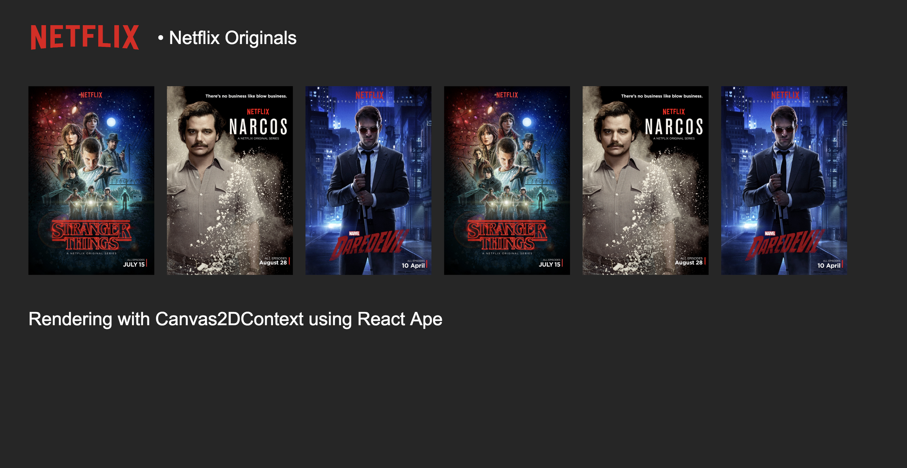

# 🦍 React Ape

> The name is a "joke" based on [Netflix's React Gibbon](https://medium.com/netflix-techblog/crafting-a-high-performance-tv-user-interface-using-react-3350e5a6ad3b). I choose to use Ape then.

React Renderer to build UI interfaces using canvas/WebGL. React Ape was built to be an optional [React-TV](https://github.com/raphamorim/react-tv) renderer. It's mainly a renderer focused on creating things for TV, PS4, Nintendo Switch, PS Vita, PS3 and low memory devices.


## Under Development

1 - React Ape IS NOT Ready Yet.

2 - Should follow React Native Elements and Primitives. So will be easy to convert React Components (without bridges) to Canvas/WebGL.

3 - Accept Style as JavaScript Object.

4 - Allow to create React Components based on Canvas. 

5 - Allow to inspect React Elements using React DevTools.

6 - I confess there's a lot of ideas and sketches in my head and I'll update the Readme when things become more clear.

## Usage



```jsx
import React from 'react'
import { render, Text, ListView, View, Image } from 'react-ape'

class App extends React.Component {
  constructor() {
    super()
    this.posters = [
      { name: 'Narcos', src: 'posters/narcos.jpg' },
      { name: 'Daredevil', src: 'posters/daredevil.jpg' },
      { name: 'Stranger Things', src: 'posters/stranger-things.jpg' },
    ]
  }

  renderPostersList() {
    const renderRow = (data, idx) => (
      <View key={idx} onClick={() => { console.log(data) }}>
        <Image src={data.src} width={200} height={300}/>
        <Text content={data.name}/>
      </View>
    )

    return (
      <ListView
        dataSource={this.posters}
        renderRow={renderRow}
        style={{ top: 100, left: 30 }}
      />
    )
  }

  render() {
    return (
      <View>
        <Image
          src={'http://www.stickpng.com/assets/images/580b57fcd9996e24bc43c529.png'}
          style={{
            top: 10,
            left: 30,
          }}
          width={210}
          height={100}
        />
        <Text
          style={{
            top: 73,
            left: 250,
            fontFamily: 'Arial',
            fontWeight: 'bold',
            fontSize: 29,
          }}
        >
          • Netflix Originals
        </Text>
        { this.renderPostersList() }
      </View>
    )
  }
}

render(<App/>, document.getElementById('canvas-id'))
```

## React Ape Components

React Ape provides a set of standard React components that abstract the underlying rendering implementation.

### `<View>`

### `<ListView>`

### `<Text>`

Text is a flexible component that supports multi-line truncation, something which has historically been difficult and very expensive to do in DOM.

### `<Image>`

Image is exactly what you think it is. However, it adds the ability to hide an image until it is fully loaded and optionally fade it in on load.

### `StyleSheet`

## Roadmap

#### Stage 1

Initial proof-of-concept.

- [ ] `ListView`
- [ ] `View`
- [ ] Resize
- [ ] Allow switch to WebGL
- [ ] Support custom React Components which have access to ApeContext (`Canvas2DContext` or WebGL Scene)
- [ ] Start support to Events/Interaction!
  - [ ] handleClick
  - [ ] handleDoubleClick
  - [ ] handleTouchStart
  - [ ] handleTouchMove
  - [ ] handleTouchEnd
  - [ ] Drag and Drop

## References

- https://github.com/raphamorim/react-tv
- https://medium.com/netflix-techblog/crafting-a-high-performance-tv-user-interface-using-react-3350e5a6ad3b
- https://github.com/Flipboard/react-canvas
- https://github.com/nitin42/Making-a-custom-React-renderer


