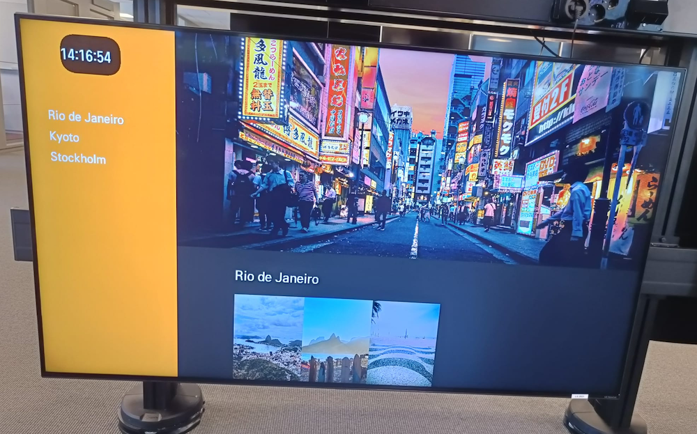

# [React Ape](https://raphamorim.io/react-ape)

> React Renderer to build UI interfaces using WebAssembly/Canvas (fallback to JS/Canvas)


## [Check the Docs](https://raphamorim.io/react-ape)

## [Join our Discord](https://discord.gg/njHHfRzJ42)

### DISCLAIMER: In experimental stage

React Ape is a react renderer to build UI interfaces using canvas/WebGL. React Ape was built to be an optional [React-TV](https://github.com/raphamorim/react-tv) renderer. It's mainly a renderer focused on creating things for TV, PS5, PS4, Nintendo Switch, PS Vita, PS3 and low memory devices.

React Ape lets you build Canvas apps using React. React Ape uses the same design as React, letting you compose a rich UI from declarative components.

## Elements

- [`<View/>`](specs/view-spec.md)
- [`<Text/>`](specs/text-spec.md)
- [`<Image/>`](specs/image-spec.md)

## Understanding the Problem

*tl;dr:* [Crafting a high-performance TV user interface using React](https://netflixtechblog.com/crafting-a-high-performance-tv-user-interface-using-react-3350e5a6ad3b) (and also good to read: [60 FPS on the mobile web](https://engineering.flipboard.com/2015/02/mobile-web))

Crafting a high-performance TV user interface based on DOM is a real challenge, because of some reasons:

- Limited graphics acceleration
- Single core CPUs
- High Memory Usage for a common TV App

These restrictions make super responsive 60fps experiences especially tricky. The strategy is step in the renderer based on a hardware-accelerated canvas.

## Examples

| App Name  | Github | App URL |
| ------------- | ------------- | ------------- |
| Photo Gallery | [raphamorim/react-ape-photo-gallery](https://github.com/raphamorim/react-ape-photo-gallery) | [Check it out](https://raphamorim.io/react-ape-photo-gallery/)  |
| Movie List | [raphamorim/react-ape-movie-list-demo](https://github.com/raphamorim/react-ape-movie-list-demo) | [Check it out](https://raphamorim.io/react-ape-movie-list-demo/)  |
| [Add yours here](https://github.com/raphamorim/react-ape/edit/main/README.md)  | ---------  | --------- |

## API Usage

#### Install it using [NPM](https://www.npmjs.com/) or [Yarn](https://yarnpkg.com/)

```bash
# NPM
npm install react-ape

# Yarn
yarn add react-ape
```

#### React Ape's API usage example

```jsx
import React, { Component } from 'react';
import { Text, View } from 'react-ape';

class ReactApeComponent extends Component {
  render() {
    return (
      <View>
        <Text>
          Render this text on Canvas
        </Text>
        <Text>
          You just use React Ape components like 'View' and 'Text',
          just like React Native.
        </Text>
      </View>
    );
  }
}
```

## Demo on PS Vita


## Demo on TV



## Testing it

React-Ape's CI uses `macos-latest` and since canvas renders a different output based on the operating system (node-canvas have rasterize fonts in different ways based on OS). It requires run the tests on the same OS. Please be aware that if you want to contribute using a different OS, make sure that you have [Docker](https://www.docker.com/) installed.

## Roadmap

You can follow React-Ape development status here: [Roadmap](https://github.com/users/raphamorim/projects/1/views/1)

## Credits

A special thanks to [Raphael Eckhardt](https://github.com/Raphseck) for making the logo <3
